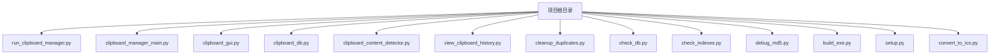
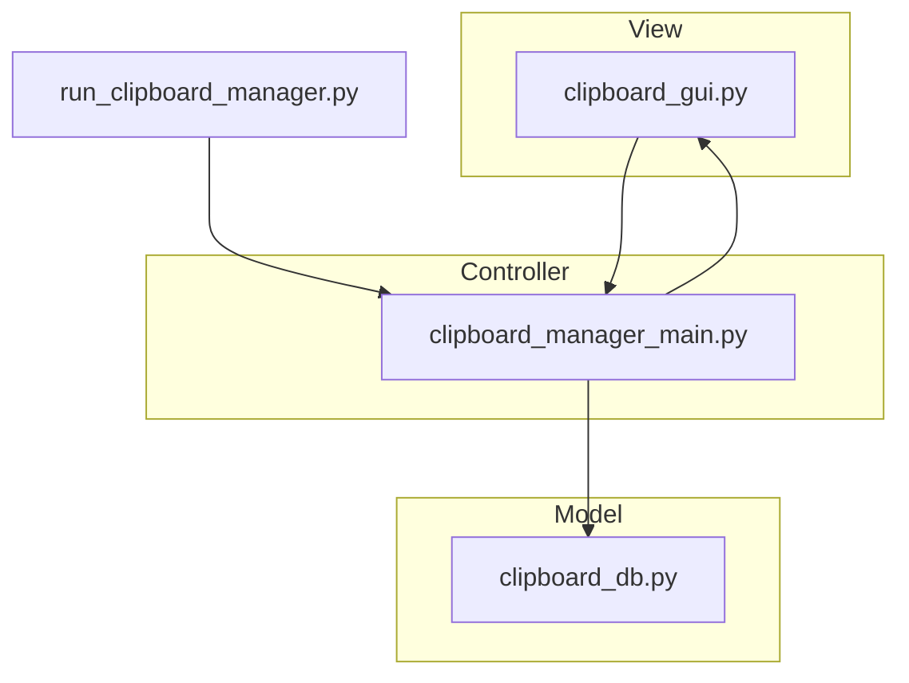
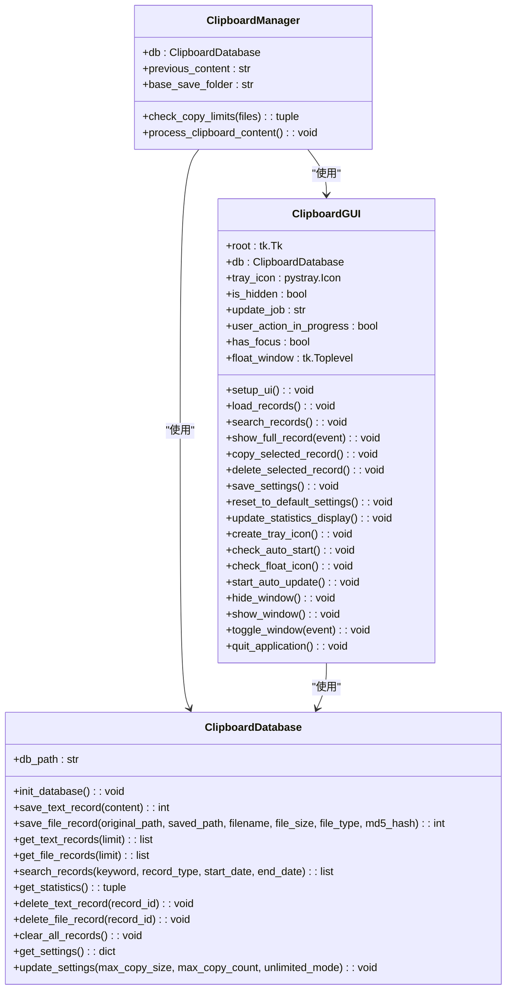
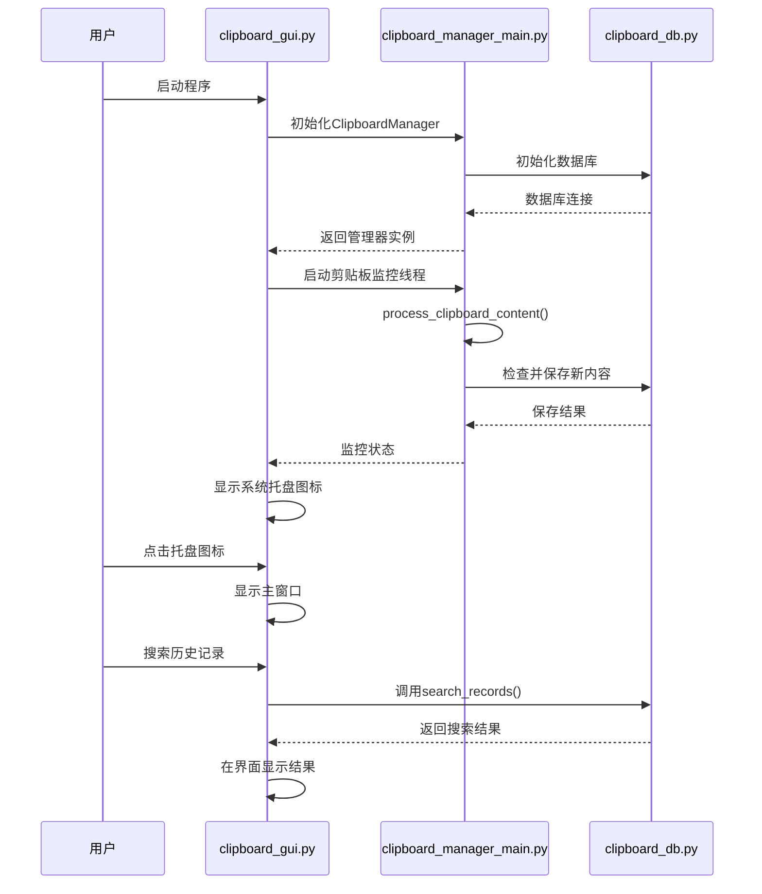
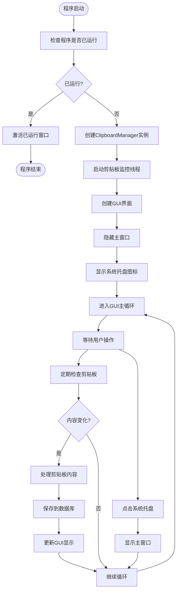
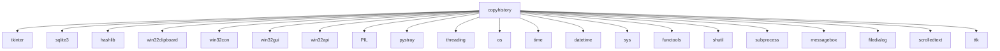

# 项目概述

<cite>
**本文档引用的文件**   
- [run_clipboard_manager.py](file://run_clipboard_manager.py)
- [clipboard_manager_main.py](file://clipboard_manager_main.py)
- [clipboard_gui.py](file://clipboard_gui.py)
- [clipboard_db.py](file://clipboard_db.py)
- [clipboard_content_detector.py](file://clipboard_content_detector.py)
- [view_clipboard_history.py](file://view_clipboard_history.py)
- [cleanup_duplicates.py](file://cleanup_duplicates.py)
- [check_db.py](file://check_db.py)
- [check_indexes.py](file://check_indexes.py)
- [debug_md5.py](file://debug_md5.py)
- [build_exe.py](file://build_exe.py)
- [setup.py](file://setup.py)
- [convert_to_ico.py](file://convert_to_ico.py)
</cite>

## 目录
1. [简介](#简介)
2. [项目结构](#项目结构)
3. [核心组件](#核心组件)
4. [架构概述](#架构概述)
5. [详细组件分析](#详细组件分析)
6. [依赖分析](#依赖分析)
7. [性能考虑](#性能考虑)
8. [故障排除指南](#故障排除指南)
9. [结论](#结论)

## 简介
copyhistory项目是一个专为Windows桌面用户设计的剪贴板历史记录管理器，旨在帮助用户高效管理复制和剪切操作的历史记录。该工具能够自动监控剪贴板内容变化，保存文本和文件内容，并通过去重机制避免重复记录。系统提供图形用户界面（GUI）展示历史记录，并集成系统托盘功能，方便用户随时访问。项目采用MVC（Model-View-Controller）设计模式，将数据管理（Model）、用户界面（View）和业务逻辑（Controller）分离，提高了代码的可维护性和可扩展性。目标用户是需要频繁复制粘贴操作的开发者、内容创作者和普通办公用户，他们可以通过该工具快速找回之前复制的内容，提高工作效率。

## 项目结构
copyhistory项目的文件组织清晰，各文件职责明确，遵循模块化设计原则。项目根目录包含多个Python脚本，每个脚本负责不同的功能模块。

**图示来源**  
- [run_clipboard_manager.py](file://run_clipboard_manager.py#L1-L71)
- [clipboard_manager_main.py](file://clipboard_manager_main.py#L1-L761)
- [clipboard_gui.py](file://clipboard_gui.py#L1-L800)
- [clipboard_db.py](file://clipboard_db.py#L1-L455)

**本节来源**  
- [run_clipboard_manager.py](file://run_clipboard_manager.py#L1-L71)
- [clipboard_manager_main.py](file://clipboard_manager_main.py#L1-L761)
- [clipboard_gui.py](file://clipboard_gui.py#L1-L800)
- [clipboard_db.py](file://clipboard_db.py#L1-L455)

## 核心组件
copyhistory项目的核心组件包括剪贴板监控器、数据库管理器、图形用户界面和主控制器。这些组件协同工作，实现剪贴板历史记录的完整管理功能。

**本节来源**  
- [run_clipboard_manager.py](file://run_clipboard_manager.py#L1-L71)
- [clipboard_manager_main.py](file://clipboard_manager_main.py#L1-L761)
- [clipboard_gui.py](file://clipboard_gui.py#L1-L800)
- [clipboard_db.py](file://clipboard_db.py#L1-L455)

## 架构概述
copyhistory项目采用MVC设计模式，将应用程序分为三个主要部分：Model（模型）、View（视图）和Controller（控制器）。这种架构使得代码结构清晰，易于维护和扩展。

**图示来源**  
- [run_clipboard_manager.py](file://run_clipboard_manager.py#L1-L71)
- [clipboard_manager_main.py](file://clipboard_manager_main.py#L1-L761)
- [clipboard_gui.py](file://clipboard_gui.py#L1-L800)
- [clipboard_db.py](file://clipboard_db.py#L1-L455)

## 详细组件分析
### 剪贴板管理器分析
剪贴板管理器是项目的核心控制器，负责协调数据库和GUI之间的交互。它通过多线程机制同时运行剪贴板监控和GUI界面，确保用户界面的响应性和后台监控的连续性。

#### 对于面向对象组件：

**图示来源**  
- [clipboard_manager_main.py](file://clipboard_manager_main.py#L355-L761)
- [clipboard_db.py](file://clipboard_db.py#L13-L455)
- [clipboard_gui.py](file://clipboard_gui.py#L37-L800)

#### 对于API/服务组件：

**图示来源**  
- [run_clipboard_manager.py](file://run_clipboard_manager.py#L32-L69)
- [clipboard_manager_main.py](file://clipboard_manager_main.py#L717-L730)
- [clipboard_gui.py](file://clipboard_gui.py#L38-L800)
- [clipboard_db.py](file://clipboard_db.py#L13-L455)

#### 对于复杂逻辑组件：

**图示来源**  
- [run_clipboard_manager.py](file://run_clipboard_manager.py#L32-L69)
- [clipboard_manager_main.py](file://clipboard_manager_main.py#L717-L730)
- [clipboard_gui.py](file://clipboard_gui.py#L38-L800)

**本节来源**  
- [run_clipboard_manager.py](file://run_clipboard_manager.py#L1-L71)
- [clipboard_manager_main.py](file://clipboard_manager_main.py#L1-L761)
- [clipboard_gui.py](file://clipboard_gui.py#L1-L800)
- [clipboard_db.py](file://clipboard_db.py#L1-L455)

## 依赖分析
copyhistory项目依赖于多个Python库和Windows API，这些依赖项为项目提供了必要的功能支持。

**图示来源**  
- [run_clipboard_manager.py](file://run_clipboard_manager.py#L8-L15)
- [clipboard_manager_main.py](file://clipboard_manager_main.py#L13-L23)
- [clipboard_gui.py](file://clipboard_gui.py#L7-L15)
- [clipboard_db.py](file://clipboard_db.py#L7-L12)
- [clipboard_content_detector.py](file://clipboard_content_detector.py#L8-L13)

**本节来源**  
- [run_clipboard_manager.py](file://run_clipboard_manager.py#L1-L71)
- [clipboard_manager_main.py](file://clipboard_manager_main.py#L1-L761)
- [clipboard_gui.py](file://clipboard_gui.py#L1-L800)
- [clipboard_db.py](file://clipboard_db.py#L1-L455)
- [clipboard_content_detector.py](file://clipboard_content_detector.py#L1-L274)

## 性能考虑
copyhistory项目在设计时考虑了性能优化，特别是在数据库操作和多线程处理方面。项目使用SQLite数据库作为持久化存储，通过索引优化查询性能。剪贴板监控采用独立线程运行，避免阻塞GUI主线程，确保用户界面的流畅性。数据库操作使用连接池和事务处理，减少I/O开销。对于大文件复制，项目设置了大小和数量限制，防止系统资源过度消耗。此外，项目还实现了去重机制，避免存储重复内容，节省磁盘空间。

## 故障排除指南
当使用copyhistory项目时，可能会遇到一些常见问题。以下是针对这些问题的解决方案：

**本节来源**  
- [run_clipboard_manager.py](file://run_clipboard_manager.py#L17-L30)
- [clipboard_gui.py](file://clipboard_gui.py#L18-L26)
- [clipboard_manager_main.py](file://clipboard_manager_main.py#L489-L495)

## 结论
copyhistory项目是一个功能完善的剪贴板历史记录管理器，通过MVC架构实现了良好的代码组织和可维护性。项目充分利用Python的跨平台特性和Windows API，为用户提供了一个高效、易用的剪贴板管理工具。通过多线程、数据库优化和用户友好的GUI设计，项目在性能和用户体验方面都表现出色。未来可以考虑增加云同步功能、跨平台支持和更高级的搜索过滤选项，进一步提升产品的竞争力。