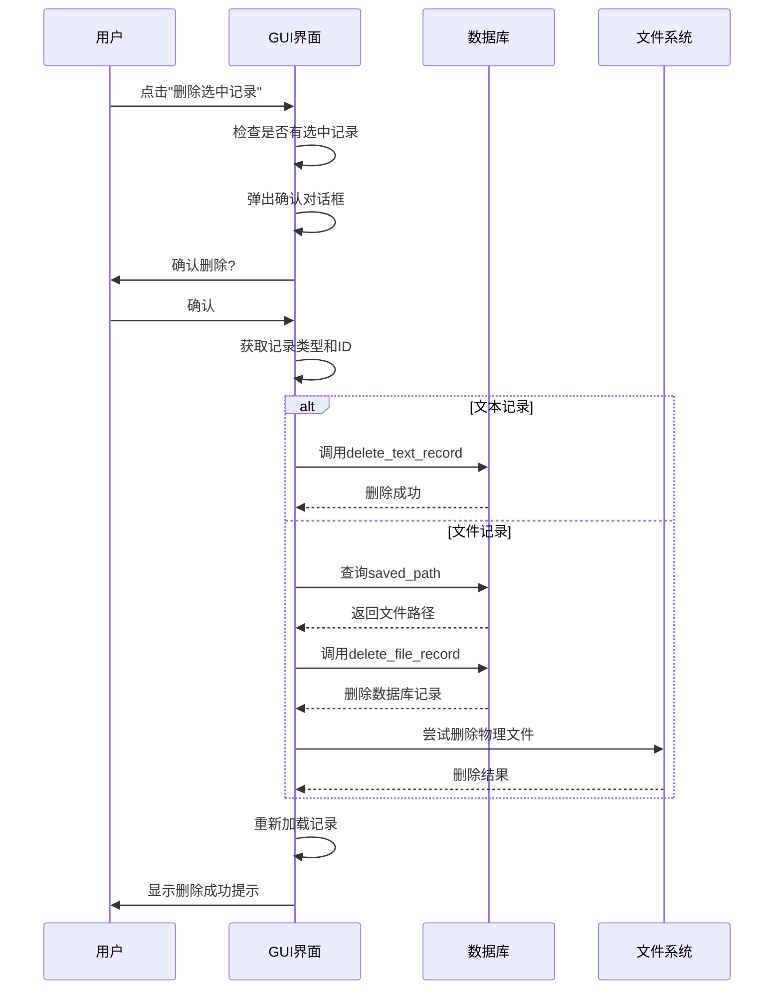
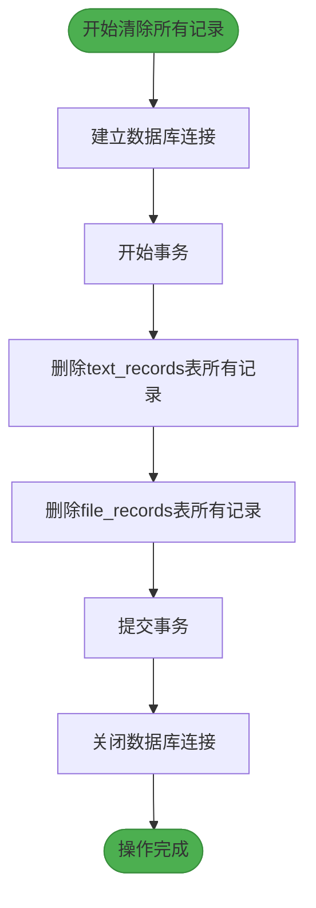
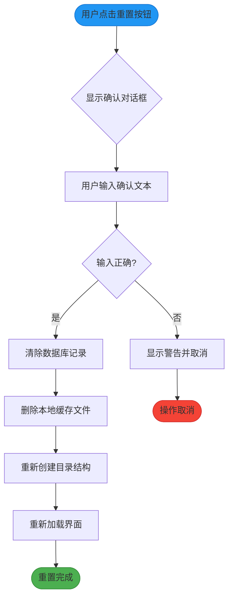
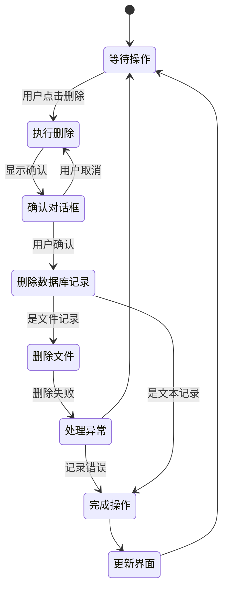

# 批量操作

<cite>
**本文档引用的文件**   
- [clipboard_db.py](file://clipboard_db.py)
- [clipboard_gui.py](file://clipboard_gui.py)
</cite>

## 目录
1. [简介](#简介)
2. [批量删除机制](#批量删除机制)
3. [清除所有记录实现](#清除所有记录实现)
4. [重置所有记录功能](#重置所有记录功能)
5. [用户确认与错误处理](#用户确认与错误处理)
6. [操作流程示例](#操作流程示例)
7. [性能优化](#性能优化)
8. [常见问题解决](#常见问题解决)

## 简介
本文档详细说明剪贴板历史记录管理器中的批量操作机制。系统提供了多种批量操作功能，包括删除选中记录、清除所有数据库记录以及重置所有记录（包括数据库和文件系统）。这些功能通过精心设计的用户界面和后端逻辑实现，确保数据一致性和用户体验。

**Section sources**
- [clipboard_gui.py](file://clipboard_gui.py#L37-L1730)
- [clipboard_db.py](file://clipboard_db.py#L1-L455)

## 批量删除机制
`delete_selected_record` 方法实现了删除用户选中记录的功能。当用户点击"删除选中记录"按钮时，系统首先检查是否有选中的记录，然后弹出确认对话框。如果用户确认删除，系统会根据记录类型（文本或文件）执行相应的删除操作。

对于文本记录，系统直接调用数据库的 `delete_text_record` 方法删除对应ID的记录。对于文件记录，系统不仅删除数据库中的记录，还会检查并删除对应的物理文件。系统通过查询 `file_records` 表中的 `saved_path` 字段获取文件保存路径，然后调用 `check_and_delete_file` 方法尝试删除文件。

**Diagram sources**
- [clipboard_gui.py](file://clipboard_gui.py#L839-L877)
- [clipboard_db.py](file://clipboard_db.py#L334-L348)

**Section sources**
- [clipboard_gui.py](file://clipboard_gui.py#L839-L877)
- [clipboard_db.py](file://clipboard_db.py#L334-L348)

## 清除所有记录实现
`clear_all_records` 方法在 `clipboard_db.py` 中实现了清除所有记录的功能。该方法使用数据库事务处理来确保数据一致性。方法首先建立数据库连接，然后执行两个DELETE语句分别清除 `text_records` 和 `file_records` 表中的所有数据。

事务处理确保了操作的原子性：要么所有删除操作都成功完成，要么在发生错误时回滚到初始状态。这种方法避免了部分删除导致的数据不一致问题。执行完删除操作后，系统提交事务并关闭数据库连接。

**Diagram sources**
- [clipboard_db.py](file://clipboard_db.py#L350-L357)

**Section sources**
- [clipboard_db.py](file://clipboard_db.py#L350-L357)

## 重置所有记录功能
`reset_all_records` 方法在设置标签页中提供了重置功能，不仅清除数据库记录还删除本地缓存文件。该功能设计了严格的安全确认机制，防止误操作。

当用户点击"重置所有记录"按钮时，系统弹出一个确认对话框，要求用户输入特定文本"确认重置所有记录"以确认操作。这种双重确认机制有效避免了意外的数据丢失。确认后，系统执行以下操作：
1. 调用 `clear_all_records` 方法清除所有数据库记录
2. 删除 `clipboard_files` 目录下的所有缓存文件
3. 重新创建 `clipboard_files` 目录结构
4. 重新加载界面显示

**Diagram sources**
- [clipboard_gui.py](file://clipboard_gui.py#L889-L937)

**Section sources**
- [clipboard_gui.py](file://clipboard_gui.py#L889-L937)

## 用户确认与错误处理
系统在执行批量操作时实现了完善的用户确认机制和错误处理策略。所有可能造成数据丢失的操作都要求用户进行明确确认，确保操作的可逆性和安全性。

对于删除操作，系统使用 `messagebox.askyesno` 弹出确认对话框，用户必须明确选择"是"才能继续操作。对于重置操作，系统采用了更严格的文本输入确认机制，要求用户输入特定文本以确认操作。

错误处理方面，系统使用try-finally结构确保资源的正确释放。在 `delete_selected_record` 方法中，`user_action_in_progress` 标志位在finally块中被重置，确保即使发生异常也能正确清理状态。对于文件删除操作，系统捕获并处理可能的异常，避免因单个文件删除失败而中断整个操作流程。

**Diagram sources**
- [clipboard_gui.py](file://clipboard_gui.py#L839-L877)
- [clipboard_gui.py](file://clipboard_gui.py#L889-L937)

**Section sources**
- [clipboard_gui.py](file://clipboard_gui.py#L839-L877)
- [clipboard_gui.py](file://clipboard_gui.py#L889-L937)

## 操作流程示例
从用户点击删除按钮到数据从数据库和文件系统中移除的完整流程如下：

1. 用户在记录列表中选择一条记录并点击"删除选中记录"按钮
2. 系统检查是否有选中记录，如果没有则显示警告
3. 系统弹出确认对话框，等待用户确认
4. 用户确认后，系统获取选中记录的类型和ID
5. 根据记录类型执行相应操作：
   - 文本记录：直接删除数据库记录
   - 文件记录：先删除数据库记录，再删除物理文件
6. 操作完成后重新加载记录列表
7. 显示删除成功提示

此流程确保了操作的安全性和可靠性，用户可以清晰地了解每个步骤的状态。

**Section sources**
- [clipboard_gui.py](file://clipboard_gui.py#L839-L877)

## 性能优化
针对大数量删除时的效率问题，系统采用了多项性能优化措施：

1. **批量操作优化**：`clear_all_records` 方法使用单条DELETE语句清除整个表，而不是逐条删除记录，大大提高了删除效率。
2. **事务处理**：所有数据库操作都在事务中执行，减少了数据库的I/O开销。
3. **连接复用**：数据库操作使用连接池模式，避免了频繁创建和销毁连接的开销。
4. **异步更新**：界面更新采用定时器机制，避免频繁刷新导致的性能问题。

对于大量数据的删除，建议使用"清除所有记录"功能而非逐条删除，这样可以显著提高操作效率。

**Section sources**
- [clipboard_db.py](file://clipboard_db.py#L350-L357)
- [clipboard_gui.py](file://clipboard_gui.py#L1676-L1695)

## 常见问题解决
### 删除后界面未更新
问题原因：界面更新机制被阻止或更新任务被取消。

解决方案：
1. 确保 `update_job` 定时器正常运行
2. 检查 `user_action_in_progress` 标志位是否正确重置
3. 确认 `load_records` 方法被正确调用

### 文件删除失败
问题原因：文件被其他进程占用或权限不足。

解决方案：
1. 检查文件是否被其他程序打开
2. 确认程序有足够的文件系统权限
3. 查看错误日志获取具体错误信息
4. 重启程序后重试

### 重置操作卡住
问题原因：大量文件删除需要较长时间。

解决方案：
1. 等待操作完成，系统会自动处理
2. 检查磁盘空间和性能
3. 如果长时间无响应，可尝试手动删除 `clipboard_files` 目录

**Section sources**
- [clipboard_gui.py](file://clipboard_gui.py#L839-L877)
- [clipboard_gui.py](file://clipboard_gui.py#L889-L937)
- [clipboard_gui.py](file://clipboard_gui.py#L1676-L1695)