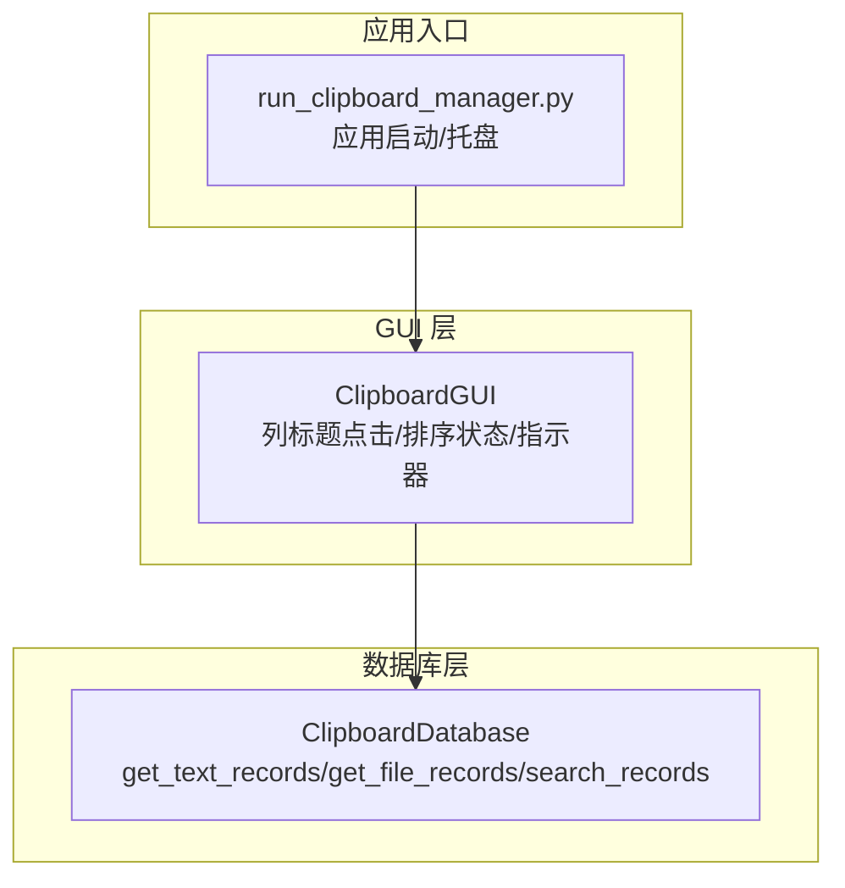
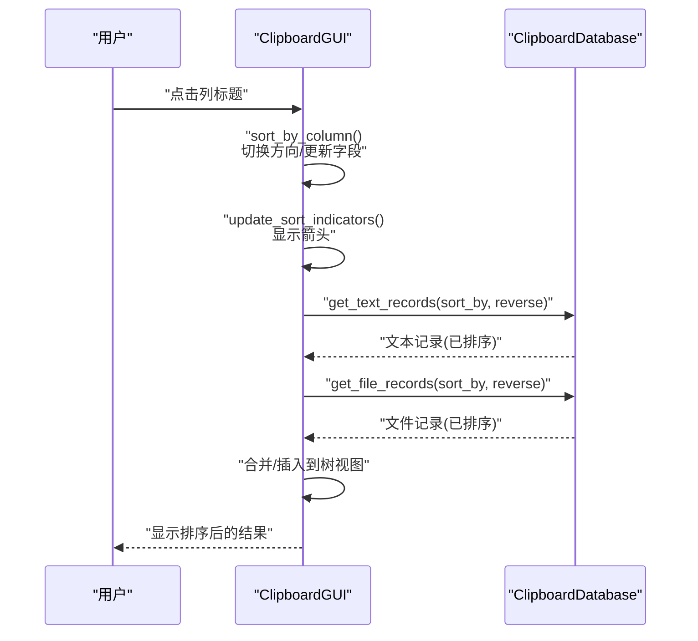
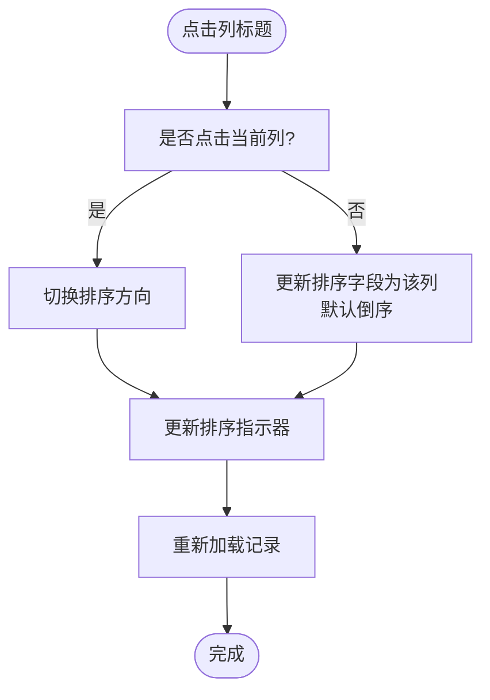
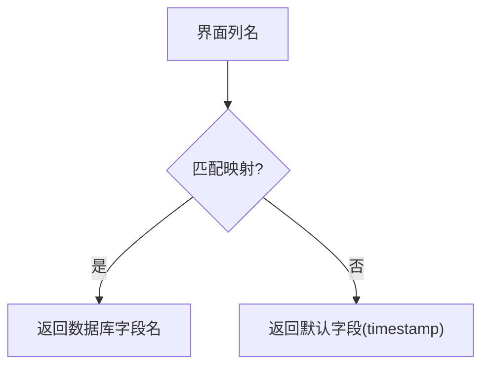
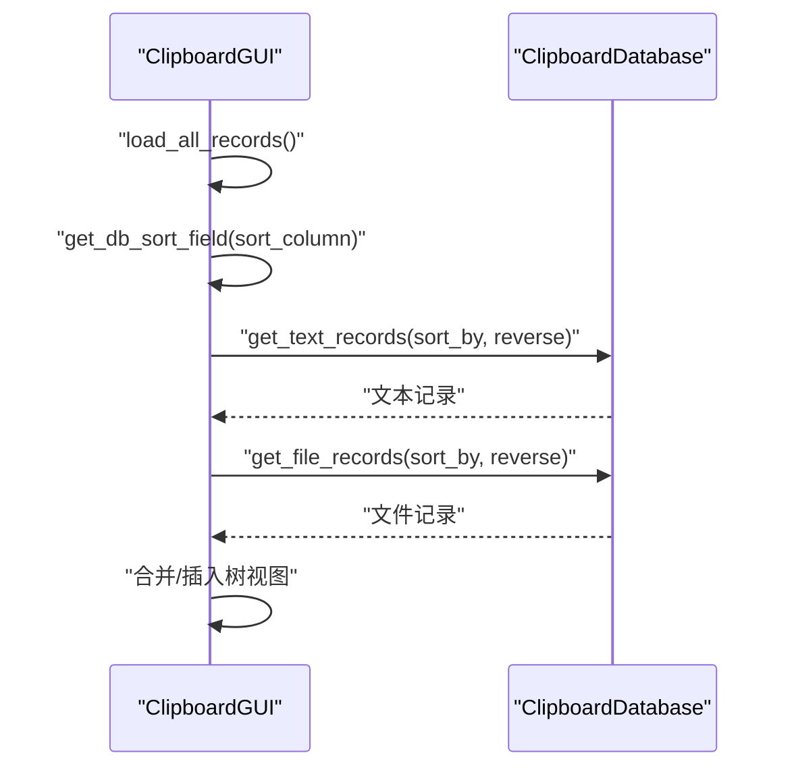
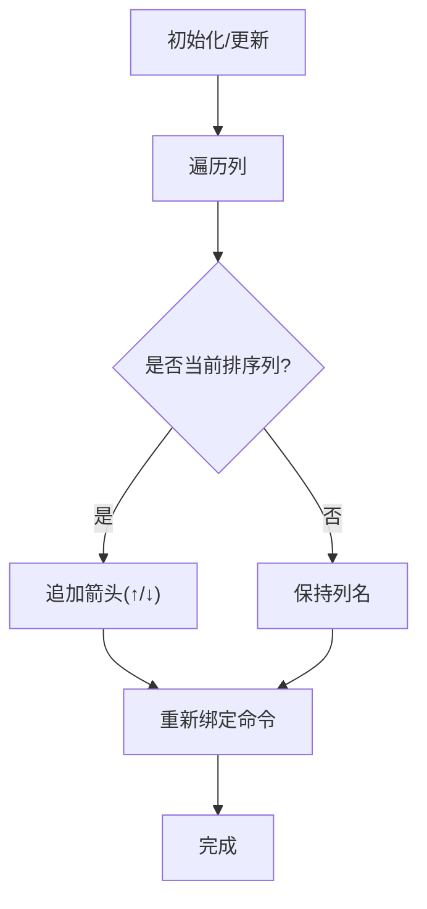
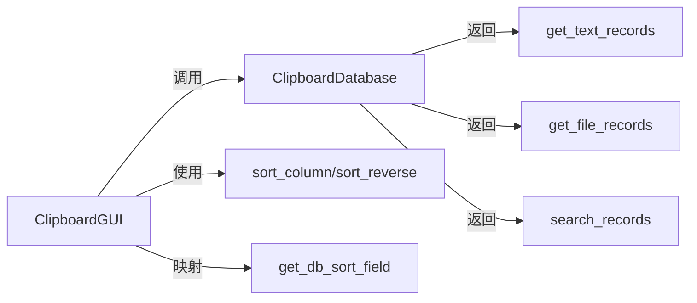

# 排序功能

<cite>
**本文引用的文件**
- [clipboard_gui.py](file://clipboard_gui.py)
- [clipboard_db.py](file://clipboard_db.py)
- [run_clipboard_manager.py](file://run_clipboard_manager.py)
- [clipboard_manager_main.py](file://clipboard_manager_main.py)
</cite>

## 目录
1. [简介](#简介)
2. [项目结构](#项目结构)
3. [核心组件](#核心组件)
4. [架构总览](#架构总览)
5. [详细组件分析](#详细组件分析)
6. [依赖关系分析](#依赖关系分析)
7. [性能考量](#性能考量)
8. [故障排查指南](#故障排查指南)
9. [结论](#结论)

## 简介
本章节聚焦“排序功能”的实现机制，围绕以下目标展开：
- 用户点击列标题时，如何响应并切换排序字段与方向
- 如何将界面列名映射到数据库字段名
- 如何在加载记录时根据排序参数调用数据库接口
- 如何在列标题上显示排序箭头
- 搜索结果中如何应用相同的排序逻辑
- 提供排序流程的代码示例路径
- 讨论排序在大数据集下的性能影响
- 解决常见问题，如排序状态丢失、数值字段排序异常等

## 项目结构
排序功能主要分布在 GUI 层与数据库层两个模块：
- GUI 层负责用户交互、状态维护与排序指示器更新
- 数据库层负责实际的数据查询与排序



图表来源
- [clipboard_gui.py](file://clipboard_gui.py#L238-L308)
- [clipboard_db.py](file://clipboard_db.py#L185-L261)
- [run_clipboard_manager.py](file://run_clipboard_manager.py#L32-L66)

章节来源
- [clipboard_gui.py](file://clipboard_gui.py#L238-L308)
- [clipboard_db.py](file://clipboard_db.py#L185-L261)
- [run_clipboard_manager.py](file://run_clipboard_manager.py#L32-L66)

## 核心组件
- 列标题点击与排序状态
  - sort_by_column：处理列标题点击，切换排序方向或更新排序字段，并刷新排序指示器与重新加载记录
  - update_sort_indicators：在列标题显示排序箭头（升/降）
  - sort_column、sort_reverse：记录当前排序字段与方向
- 字段映射
  - get_db_sort_field：将界面列名映射到数据库字段名
- 数据加载与排序
  - load_records/load_all_records：清空树视图，依据当前排序参数调用数据库接口，合并文本与文件两类记录并插入
  - get_text_records/get_file_records：数据库侧按字段与方向排序返回
- 搜索结果排序
  - search_records：调用数据库搜索
  - sort_search_results：对搜索结果进行二次排序并显示

章节来源
- [clipboard_gui.py](file://clipboard_gui.py#L238-L308)
- [clipboard_gui.py](file://clipboard_gui.py#L581-L637)
- [clipboard_gui.py](file://clipboard_gui.py#L652-L748)
- [clipboard_db.py](file://clipboard_db.py#L185-L261)

## 架构总览
排序流程从用户点击列标题开始，贯穿 GUI 状态更新、字段映射、数据库查询与结果渲染。



图表来源
- [clipboard_gui.py](file://clipboard_gui.py#L280-L308)
- [clipboard_gui.py](file://clipboard_gui.py#L581-L637)
- [clipboard_db.py](file://clipboard_db.py#L185-L261)

## 详细组件分析

### 列标题点击与排序状态切换
- 行为特征
  - 若点击的是当前列：切换排序方向
  - 若点击的是其他列：更新排序字段并默认倒序
  - 更新排序指示器并重新加载记录
- 关键实现路径
  - sort_by_column：[clipboard_gui.py](file://clipboard_gui.py#L280-L293)
  - update_sort_indicators：[clipboard_gui.py](file://clipboard_gui.py#L295-L308)



图表来源
- [clipboard_gui.py](file://clipboard_gui.py#L280-L308)

章节来源
- [clipboard_gui.py](file://clipboard_gui.py#L280-L308)

### 字段映射：界面列名到数据库字段名
- 映射规则
  - 名称或内容 -> content
  - 类型 -> file_type
  - 大小 -> file_size
  - 时间 -> timestamp
  - 次数 -> number
- 实现路径
  - get_db_sort_field：[clipboard_gui.py](file://clipboard_gui.py#L627-L636)



图表来源
- [clipboard_gui.py](file://clipboard_gui.py#L627-L636)

章节来源
- [clipboard_gui.py](file://clipboard_gui.py#L627-L636)

### 加载记录：根据排序参数调用数据库
- 流程
  - 清空树视图
  - 通过 get_db_sort_field 获取数据库字段
  - 分别调用 get_text_records 与 get_file_records，传入排序字段与方向
  - 合并两类记录，插入树视图
- 实现路径
  - load_all_records：[clipboard_gui.py](file://clipboard_gui.py#L585-L637)
  - get_text_records：[clipboard_db.py](file://clipboard_db.py#L185-L221)
  - get_file_records：[clipboard_db.py](file://clipboard_db.py#L223-L261)



图表来源
- [clipboard_gui.py](file://clipboard_gui.py#L585-L637)
- [clipboard_db.py](file://clipboard_db.py#L185-L261)

章节来源
- [clipboard_gui.py](file://clipboard_gui.py#L585-L637)
- [clipboard_db.py](file://clipboard_db.py#L185-L261)

### 排序指示器：列标题显示箭头
- 实现要点
  - 遍历所有列，若为当前排序列则追加箭头（升/降）
  - 重新绑定列标题命令，保持点击行为
- 实现路径
  - update_sort_indicators：[clipboard_gui.py](file://clipboard_gui.py#L295-L308)



图表来源
- [clipboard_gui.py](file://clipboard_gui.py#L295-L308)

章节来源
- [clipboard_gui.py](file://clipboard_gui.py#L295-L308)

### 搜索结果中的排序逻辑
- 流程
  - 搜索：调用数据库 search_records
  - 二次排序：根据当前 sort_column 与 sort_reverse 对结果进行排序
  - 数值字段特殊处理：大小与次数字段按数值排序，异常值回退为 0
  - 显示：将排序后的结果插入树视图
- 实现路径
  - search_records：[clipboard_gui.py](file://clipboard_gui.py#L652-L667)
  - sort_search_results：[clipboard_gui.py](file://clipboard_gui.py#L668-L748)
  - search_records（数据库）：[clipboard_db.py](file://clipboard_db.py#L281-L314)

```mermaid
flowchart TD
S0["用户输入关键词"] --> S1["调用数据库 search_records()"]
S1 --> S2["收集文本/文件记录信息"]
S2 --> S3{"按哪一列排序?"}
S3 --> |文本列| S4["按对应列文本排序(reverse)"]
S3 --> |数值列(大小/次数)| S5["数值解析/排序(reverse)"]
S4 --> S6["插入树视图"]
S5 --> S6
S6 --> End(["完成"])
```

图表来源
- [clipboard_gui.py](file://clipboard_gui.py#L652-L748)
- [clipboard_db.py](file://clipboard_db.py#L281-L314)

章节来源
- [clipboard_gui.py](file://clipboard_gui.py#L652-L748)
- [clipboard_db.py](file://clipboard_db.py#L281-L314)

### 代码示例路径（排序流程）
- 列标题点击与排序状态切换
  - [clipboard_gui.py](file://clipboard_gui.py#L280-L293)
- 排序指示器更新
  - [clipboard_gui.py](file://clipboard_gui.py#L295-L308)
- 字段映射
  - [clipboard_gui.py](file://clipboard_gui.py#L627-L636)
- 加载记录并调用数据库
  - [clipboard_gui.py](file://clipboard_gui.py#L585-L637)
  - [clipboard_db.py](file://clipboard_db.py#L185-L261)
- 搜索结果排序
  - [clipboard_gui.py](file://clipboard_gui.py#L652-L748)
  - [clipboard_db.py](file://clipboard_db.py#L281-L314)

章节来源
- [clipboard_gui.py](file://clipboard_gui.py#L280-L308)
- [clipboard_gui.py](file://clipboard_gui.py#L585-L637)
- [clipboard_gui.py](file://clipboard_gui.py#L627-L636)
- [clipboard_gui.py](file://clipboard_gui.py#L652-L748)
- [clipboard_db.py](file://clipboard_db.py#L185-L261)
- [clipboard_db.py](file://clipboard_db.py#L281-L314)

## 依赖关系分析
- GUI 依赖数据库层提供的查询接口
- 排序参数由 GUI 维护并通过 get_text_records/get_file_records 传入
- 搜索结果排序在 GUI 层完成，依赖当前排序状态



图表来源
- [clipboard_gui.py](file://clipboard_gui.py#L280-L308)
- [clipboard_gui.py](file://clipboard_gui.py#L585-L637)
- [clipboard_gui.py](file://clipboard_gui.py#L627-L636)
- [clipboard_db.py](file://clipboard_db.py#L185-L261)
- [clipboard_db.py](file://clipboard_db.py#L281-L314)

章节来源
- [clipboard_gui.py](file://clipboard_gui.py#L280-L308)
- [clipboard_gui.py](file://clipboard_gui.py#L585-L637)
- [clipboard_gui.py](file://clipboard_gui.py#L627-L636)
- [clipboard_db.py](file://clipboard_db.py#L185-L261)
- [clipboard_db.py](file://clipboard_db.py#L281-L314)

## 性能考量
- 数据库排序
  - get_text_records/get_file_records 支持按字段与方向排序，SQL 层完成排序，避免在 Python 层做大规模内存排序
  - 当前未见显式索引定义，建议在高频排序字段（如 timestamp、file_size、number）建立索引以提升排序性能
- 搜索结果排序
  - 搜索后在 GUI 层对结果进行二次排序，涉及 Python 层 list.sort，适合中小规模结果集
  - 对于大量搜索结果，可考虑在数据库层统一排序，减少 Python 层处理量
- UI 响应
  - load_all_records 会清空并重建树视图，大数据量下可能有卡顿
  - 建议在大数据场景下采用分页或虚拟滚动策略，或在搜索结果中也引入数据库层排序

[本节为通用性能建议，不直接分析具体文件，故无章节来源]

## 故障排查指南
- 排序状态丢失
  - 现象：切换列后排序状态未持久
  - 原因：sort_column/sort_reverse 为实例变量，窗口关闭后不会持久化
  - 解决：若需持久化，可在设置中保存排序字段与方向，应用启动时恢复
  - 参考实现位置：
    - [clipboard_gui.py](file://clipboard_gui.py#L238-L308)
    - [clipboard_gui.py](file://clipboard_gui.py#L585-L637)
- 数值字段排序异常
  - 现象：大小/次数列排序不符合预期
  - 原因：sort_search_results 中对数值解析存在异常值处理，异常值回退为 0
  - 解决：确保数据格式规范；或在 GUI 层增加更严格的校验与提示
  - 参考实现位置：
    - [clipboard_gui.py](file://clipboard_gui.py#L668-L748)
- 搜索结果未按当前排序列排序
  - 现象：搜索后仍按时间排序
  - 原因：search_records 返回的记录在数据库层已按时间排序，GUI 层二次排序依赖当前 sort_column
  - 解决：在数据库层根据 sort_column 与 reverse 参数统一排序，减少 GUI 层二次处理
  - 参考实现位置：
    - [clipboard_gui.py](file://clipboard_gui.py#L652-L748)
    - [clipboard_db.py](file://clipboard_db.py#L281-L314)

章节来源
- [clipboard_gui.py](file://clipboard_gui.py#L238-L308)
- [clipboard_gui.py](file://clipboard_gui.py#L585-L637)
- [clipboard_gui.py](file://clipboard_gui.py#L652-L748)
- [clipboard_db.py](file://clipboard_db.py#L281-L314)

## 结论
- 排序功能以 GUI 为核心，通过 sort_by_column 维护排序状态，update_sort_indicators 提示当前排序方向
- get_db_sort_field 将界面列名映射到数据库字段，load_all_records 调用数据库接口获取已排序记录并合并显示
- 搜索结果在 GUI 层进行二次排序，数值字段做了异常值处理
- 建议优化方向：在数据库层统一排序、为高频排序字段建立索引、在大数据场景引入分页/虚拟滚动

[本节为总结性内容，不直接分析具体文件，故无章节来源]