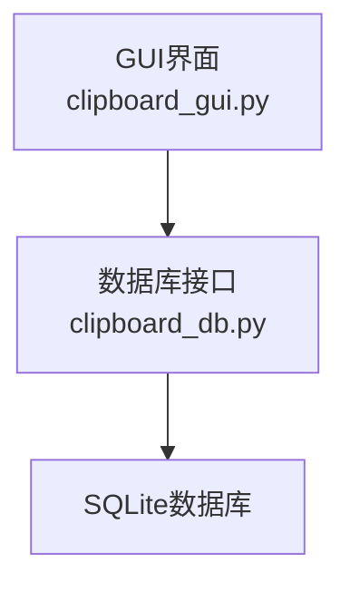
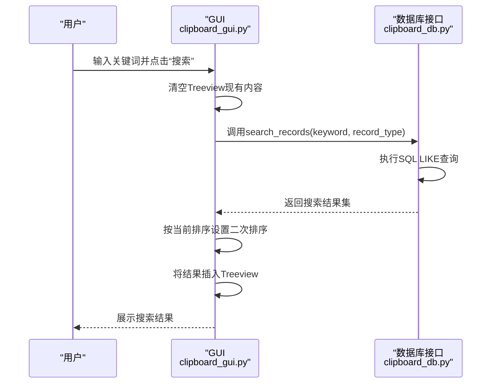
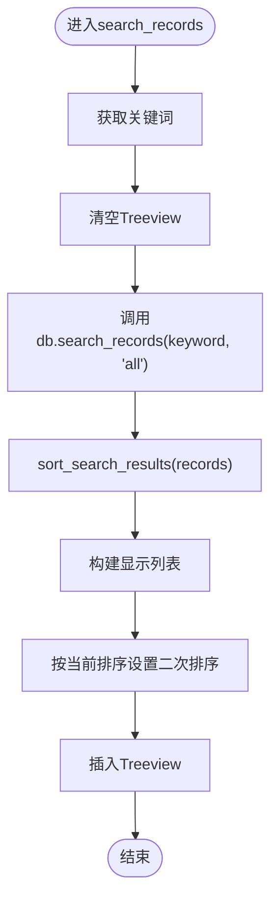
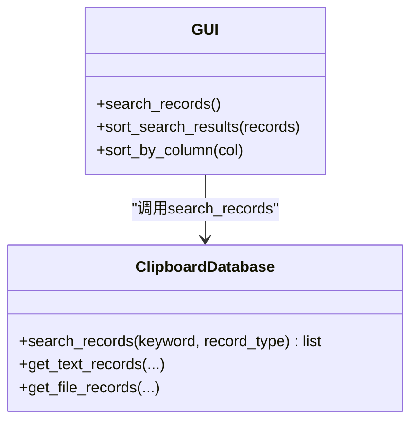

# 搜索功能

<cite>
**本文档引用的文件**
- [clipboard_gui.py](file://clipboard_gui.py)
- [clipboard_db.py](file://clipboard_db.py)
- [check_indexes.py](file://check_indexes.py)
</cite>

## 目录
1. [简介](#简介)
2. [项目结构](#项目结构)
3. [核心组件](#核心组件)
4. [架构总览](#架构总览)
5. [详细组件分析](#详细组件分析)
6. [依赖关系分析](#依赖关系分析)
7. [性能考量](#性能考量)
8. [故障排查指南](#故障排查指南)
9. [结论](#结论)

## 简介
本章节说明如何在GUI中通过“搜索”入口实现关键词搜索，支持文本记录与文件记录的全文模糊匹配。搜索流程从用户输入关键词开始，经由数据库层的search_records函数执行SQL LIKE模式匹配，最终在Treeview中呈现结果，并保持与当前排序设置一致。

## 项目结构
- GUI层负责用户交互、输入收集、结果展示与排序控制。
- 数据库层封装SQLite访问、索引初始化与查询逻辑。
- 搜索功能贯穿GUI与数据库两层，形成清晰的职责边界。

图表来源
- [clipboard_gui.py](file://clipboard_gui.py#L173-L219)
- [clipboard_db.py](file://clipboard_db.py#L1-L115)

章节来源
- [clipboard_gui.py](file://clipboard_gui.py#L173-L219)
- [clipboard_db.py](file://clipboard_db.py#L1-L115)

## 核心组件
- GUI搜索入口与结果展示
  - 搜索按钮绑定到search_records方法，负责清空旧结果、调用数据库搜索、对结果进行二次排序并插入Treeview。
  - Treeview列包括“名称或内容”、“类型”、“大小”、“时间”、“次数”，支持点击列头切换排序方向。
- 数据库搜索实现
  - search_records函数根据record_type参数选择对文本内容或文件名进行LIKE模糊匹配，返回统一结构的结果集。
  - 结果集包含类型标识、记录ID、信息字段（文本内容或文件名）、时间戳，便于GUI层统一处理。

章节来源
- [clipboard_gui.py](file://clipboard_gui.py#L181-L188)
- [clipboard_gui.py](file://clipboard_gui.py#L652-L748)
- [clipboard_db.py](file://clipboard_db.py#L281-L314)

## 架构总览
搜索功能的端到端流程如下：
- 用户在搜索框输入关键词，点击“搜索”。
- GUI层调用数据库层的search_records，传入关键词与类型。
- 数据库层执行SQL查询，使用LIKE进行模糊匹配。
- GUI层对返回结果按当前排序设置进行二次排序，并插入Treeview展示。

图表来源
- [clipboard_gui.py](file://clipboard_gui.py#L652-L748)
- [clipboard_db.py](file://clipboard_db.py#L281-L314)

## 详细组件分析

### GUI层：搜索与排序
- 搜索入口
  - 搜索框与按钮位于顶部搜索框架，点击触发search_records。
- 搜索流程
  - 清空Treeview已有节点。
  - 调用数据库search_records，传入keyword与record_type="all"。
  - 对返回结果调用sort_search_results进行二次排序与格式化，再插入Treeview。
- 排序机制
  - 列头点击会更新sort_column与sort_reverse，随后load_records或sort_search_results按当前设置排序。
  - 数值型字段（大小、次数）采用数值解析排序，文本型字段按字符串排序；异常时回退按时间排序。

图表来源
- [clipboard_gui.py](file://clipboard_gui.py#L652-L748)

章节来源
- [clipboard_gui.py](file://clipboard_gui.py#L181-L188)
- [clipboard_gui.py](file://clipboard_gui.py#L652-L748)
- [clipboard_gui.py](file://clipboard_gui.py#L280-L308)

### 数据库层：search_records实现
- 功能概述
  - 支持三种record_type：text、file、all。
  - 使用LIKE进行模糊匹配，关键词两侧加通配符以实现全文包含匹配。
  - 返回统一结构：(type, id, info, timestamp)，便于GUI层统一处理。
- SQL要点
  - 文本记录：WHERE content LIKE ?
  - 文件记录：WHERE filename LIKE ?
  - 全部类型：UNION ALL连接两个查询，最后按时间降序。
- 性能现状
  - 当前未见显式索引创建语句，LIKE通配符查询在大数据量下可能较慢。

图表来源
- [clipboard_db.py](file://clipboard_db.py#L281-L314)
- [clipboard_gui.py](file://clipboard_gui.py#L652-L748)

章节来源
- [clipboard_db.py](file://clipboard_db.py#L281-L314)

### Treeview展示与排序一致性
- 列与排序
  - Treeview列包括“名称或内容”、“类型”、“大小”、“时间”、“次数”。
  - 点击列头更新sort_column与sort_reverse，影响后续load_records与sort_search_results的排序逻辑。
- 显示细节
  - 文本记录显示内容预览，文件记录显示文件名与格式化大小。
  - “次数”来源于数据库number字段，文本记录需额外查询number，文件记录直接查询。

章节来源
- [clipboard_gui.py](file://clipboard_gui.py#L236-L261)
- [clipboard_gui.py](file://clipboard_gui.py#L280-L308)
- [clipboard_gui.py](file://clipboard_gui.py#L668-L748)

## 依赖关系分析
- GUI依赖数据库接口
  - GUI通过self.db.search_records调用数据库层的查询方法。
- 数据库层依赖SQLite
  - 使用sqlite3连接数据库，执行DDL/DML与查询。
- 索引现状
  - 初始化时为text_records的md5_hash创建了唯一索引，但未为content或filename创建索引，这会影响LIKE通配符查询性能。

图表来源
- [clipboard_db.py](file://clipboard_db.py#L18-L115)
- [check_indexes.py](file://check_indexes.py#L1-L27)

章节来源
- [clipboard_db.py](file://clipboard_db.py#L18-L115)
- [check_indexes.py](file://check_indexes.py#L1-L27)

## 性能考量
- LIKE通配符查询瓶颈
  - 当前未对content与filename建立索引，LIKE "%keyword%"在大数据量下会进行全表扫描，查询效率较低。
- 建议优化策略
  - 为text_records.content与file_records.filename创建索引，以提升LIKE通配符查询性能。
  - 若业务允许，可引入FTS5全文检索扩展，进一步提升模糊匹配与多词检索能力。
  - GUI层的sort_search_results对每条记录执行额外查询（如获取number），建议在数据库层一次性返回所需字段，减少往返。
  - 对超大数据集，可考虑分页或延迟加载策略，避免一次性渲染过多节点导致UI卡顿。

章节来源
- [clipboard_db.py](file://clipboard_db.py#L281-L314)
- [clipboard_gui.py](file://clipboard_gui.py#L668-L748)

## 故障排查指南
- 关键词为空或无结果
  - 现象：输入空关键词或无匹配项时，搜索结果为空。
  - 处理：确认输入框非空；检查数据库中是否存在目标内容或文件名。
- 特殊字符处理
  - LIKE通配符“%”和“_”在SQL中具有特殊含义，当前实现对用户输入直接拼接为“%keyword%”。若用户关键词包含这些字符，可能导致意外匹配。
  - 建议：在传入SQL前对特殊字符进行转义处理，或使用参数化查询时明确转义规则。
- 排序异常
  - 现象：数值型字段（大小、次数）排序异常或报错。
  - 处理：GUI层已做异常回退至按时间排序；若仍异常，检查数据格式与显示字符串解析逻辑。
- 空间与索引检查
  - 使用check_indexes.py脚本查看当前索引情况，确认是否缺少content与filename索引。

章节来源
- [clipboard_gui.py](file://clipboard_gui.py#L668-L748)
- [clipboard_db.py](file://clipboard_db.py#L281-L314)
- [check_indexes.py](file://check_indexes.py#L1-L27)

## 结论
搜索功能通过GUI与数据库层的协作实现了关键词的全文模糊匹配，并在Treeview中保持与当前排序设置一致。当前实现简洁可靠，但在大数据量场景下，LIKE通配符查询与多次额外查询可能成为性能瓶颈。建议优先为常用查询字段建立索引，并在数据库层一次性返回所需字段，以提升整体响应速度与用户体验。