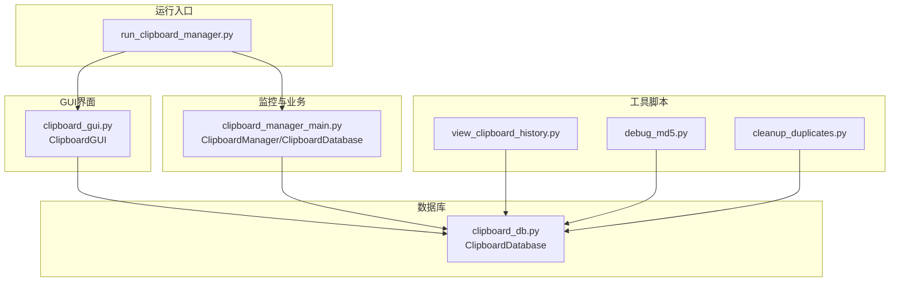
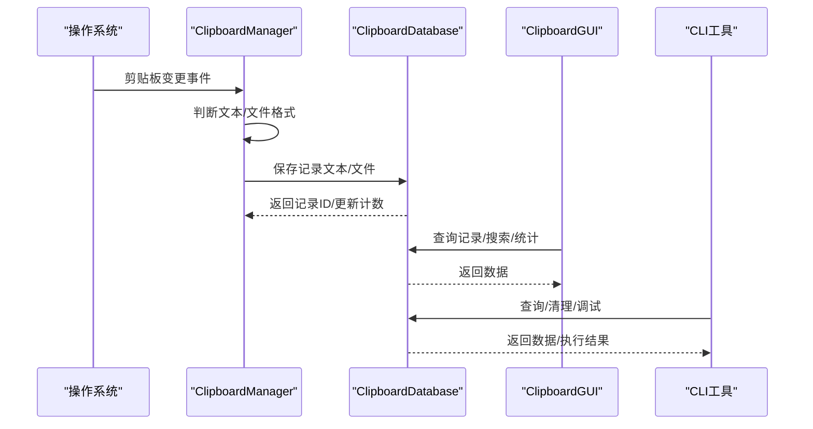
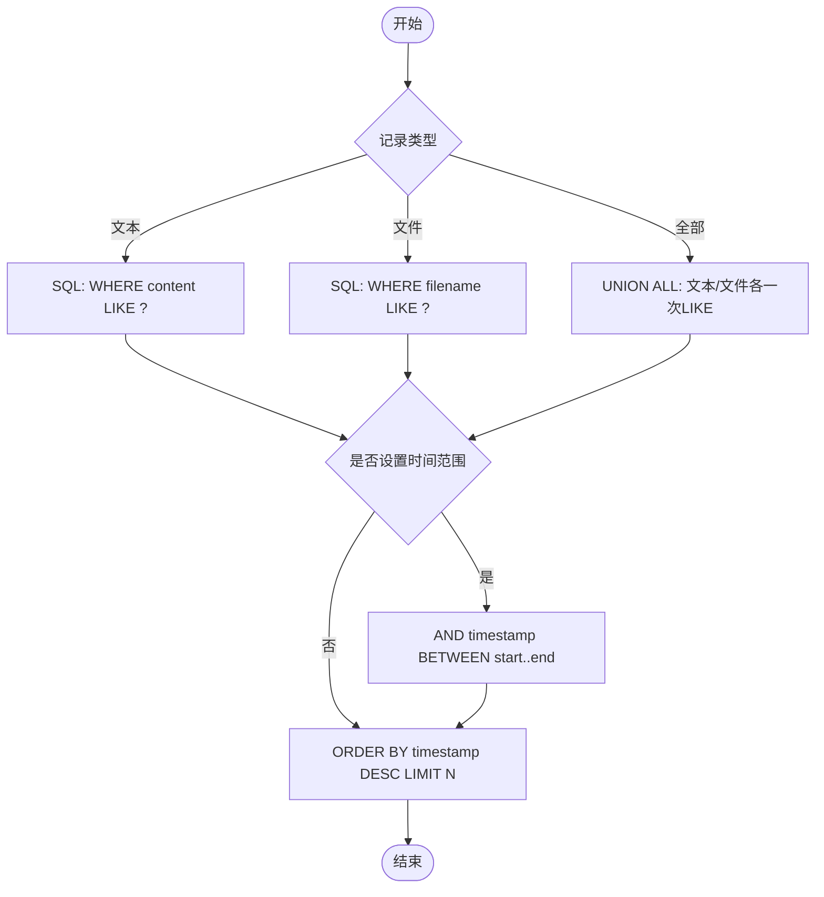
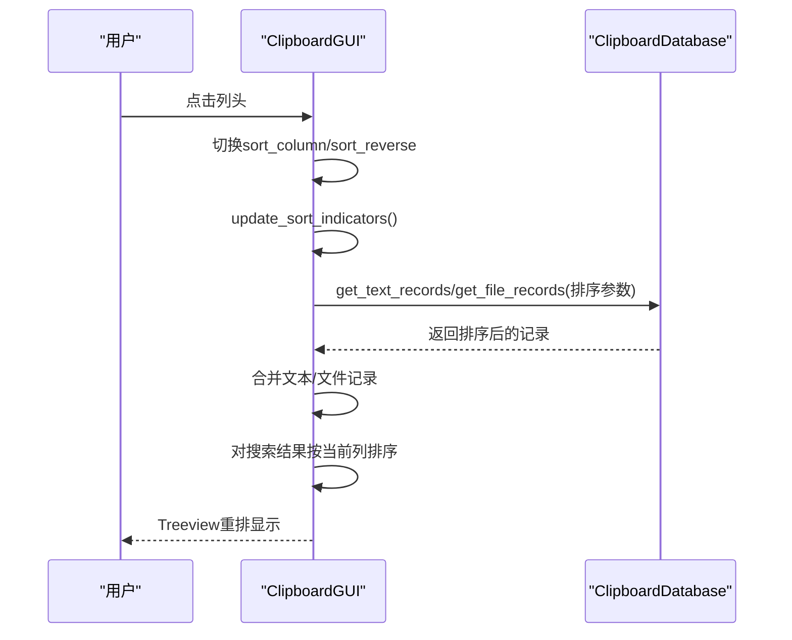
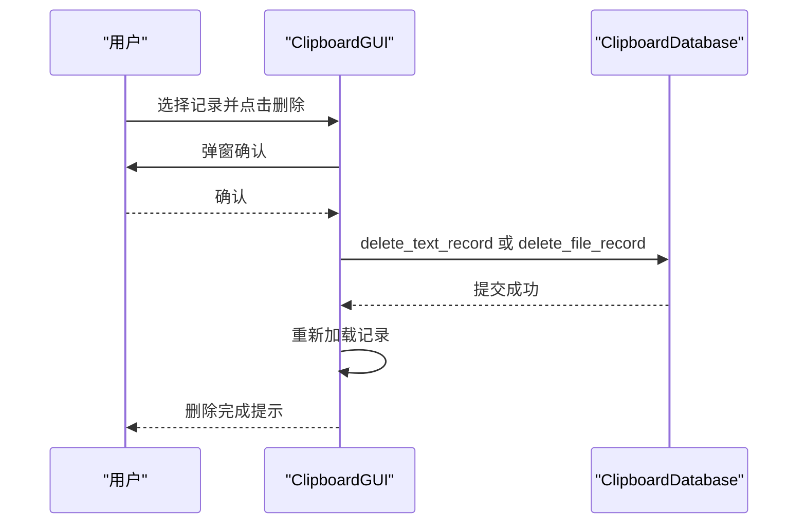
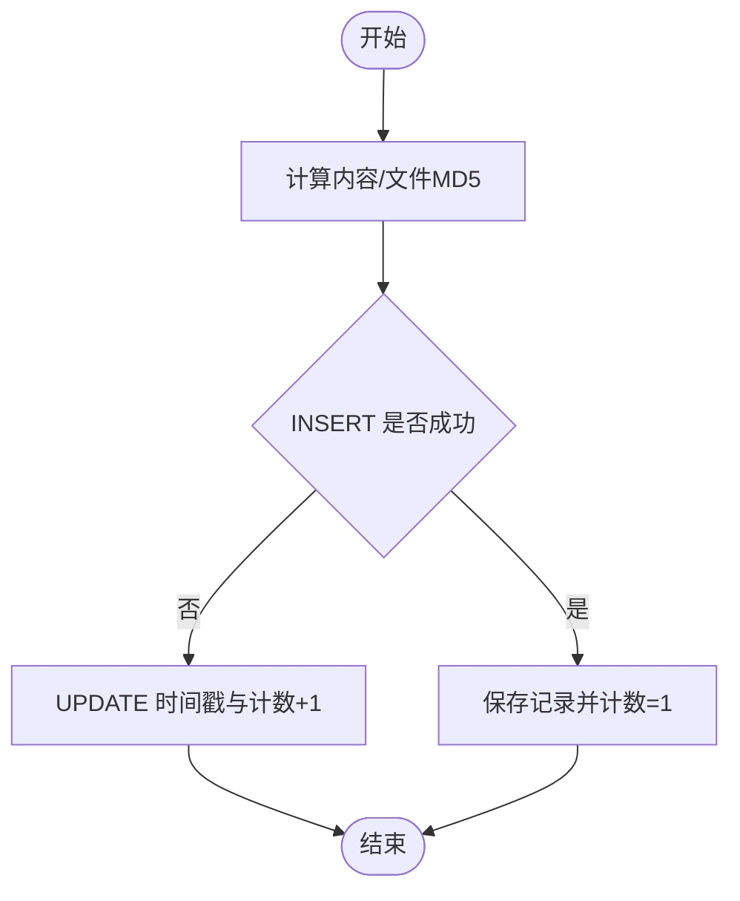
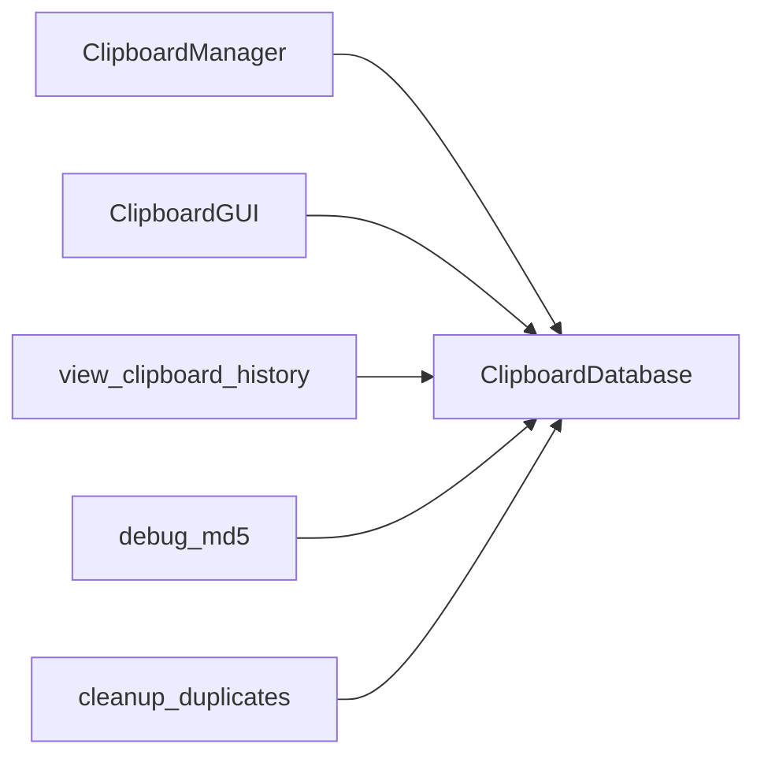
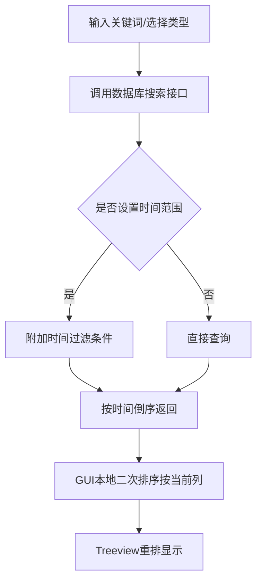

# 高级功能

<cite>
**本文档引用的文件**
- [clipboard_manager_main.py](file://clipboard_manager_main.py)
- [clipboard_db.py](file://clipboard_db.py)
- [clipboard_gui.py](file://clipboard_gui.py)
- [view_clipboard_history.py](file://view_clipboard_history.py)
- [debug_md5.py](file://debug_md5.py)
- [cleanup_duplicates.py](file://cleanup_duplicates.py)
- [run_clipboard_manager.py](file://run_clipboard_manager.py)
</cite>

## 目录
1. [简介](#简介)
2. [项目结构](#项目结构)
3. [核心组件](#核心组件)
4. [架构总览](#架构总览)
5. [详细组件分析](#详细组件分析)
6. [依赖关系分析](#依赖关系分析)
7. [性能考量](#性能考量)
8. [故障排查指南](#故障排查指南)
9. [结论](#结论)
10. [附录](#附录)

## 简介
本文件聚焦于系统的高级功能特性，围绕以下主题展开：
- 搜索功能：关键词匹配、时间范围过滤（含GUI与CLI两种入口）、排序与展示
- 排序功能：动态重排Treeview数据，支持按时间、长度、类型等多维
- 批量操作：单条删除、清空记录、重置数据（含确认流程）
- 去重算法：基于MD5的重复检测与合并，以及独立清理脚本
- 文件分类：按扩展名自动归类（文档、图片、代码等）
- 数据导出：潜在扩展点（CSV/JSON等）
- 高级配置：最大复制大小限制对系统资源的影响
- 性能基准：大规模数据下的搜索响应时间建议

## 项目结构
系统由“监控器 + GUI + 数据库 + 工具脚本”构成，核心交互通过数据库统一管理，GUI负责展示与交互，CLI工具用于查看与调试。

图表来源
- [run_clipboard_manager.py](file://run_clipboard_manager.py#L1-L71)
- [clipboard_manager_main.py](file://clipboard_manager_main.py#L1-L120)
- [clipboard_gui.py](file://clipboard_gui.py#L1-L120)
- [clipboard_db.py](file://clipboard_db.py#L1-L120)
- [view_clipboard_history.py](file://view_clipboard_history.py#L1-L75)
- [debug_md5.py](file://debug_md5.py#L1-L56)
- [cleanup_duplicates.py](file://cleanup_duplicates.py#L1-L67)

章节来源
- [run_clipboard_manager.py](file://run_clipboard_manager.py#L1-L71)
- [clipboard_manager_main.py](file://clipboard_manager_main.py#L1-L120)
- [clipboard_gui.py](file://clipboard_gui.py#L1-L120)
- [clipboard_db.py](file://clipboard_db.py#L1-L120)
- [view_clipboard_history.py](file://view_clipboard_history.py#L1-L75)
- [debug_md5.py](file://debug_md5.py#L1-L56)
- [cleanup_duplicates.py](file://cleanup_duplicates.py#L1-L67)

## 核心组件
- 剪贴板监控与入库：监控剪贴板变化，区分文本与文件，计算MD5，避免重复，写入数据库
- 数据库层：统一管理文本/文件记录、设置、统计、删除过期记录
- GUI界面：记录浏览、搜索、排序、删除、设置、统计
- CLI工具：查看历史、调试MD5、清理重复

章节来源
- [clipboard_manager_main.py](file://clipboard_manager_main.py#L120-L235)
- [clipboard_db.py](file://clipboard_db.py#L116-L210)
- [clipboard_gui.py](file://clipboard_gui.py#L180-L280)
- [view_clipboard_history.py](file://view_clipboard_history.py#L1-L75)
- [debug_md5.py](file://debug_md5.py#L1-L56)
- [cleanup_duplicates.py](file://cleanup_duplicates.py#L1-L67)

## 架构总览
系统采用“监控线程 + GUI主线程”的并发模型，数据库作为唯一数据源，GUI与CLI通过数据库接口读写数据。

图表来源
- [clipboard_manager_main.py](file://clipboard_manager_main.py#L395-L496)
- [clipboard_db.py](file://clipboard_db.py#L116-L210)
- [clipboard_gui.py](file://clipboard_gui.py#L581-L626)
- [view_clipboard_history.py](file://view_clipboard_history.py#L21-L75)
- [debug_md5.py](file://debug_md5.py#L11-L56)
- [cleanup_duplicates.py](file://cleanup_duplicates.py#L1-L67)

## 详细组件分析

### 搜索功能：关键词匹配、时间范围过滤与排序
- 关键词匹配
  - 文本记录：按内容字段进行模糊匹配
  - 文件记录：按文件名字段进行模糊匹配
  - 全部类型：联合查询文本与文件，分别匹配后合并
- 时间范围过滤
  - 支持起止时间条件，最终按时间倒序返回
- 排序与展示
  - GUI侧：记录标签页支持点击列头进行排序（时间默认倒序）
  - CLI侧：历史查看器按时间倒序输出

图表来源
- [clipboard_manager_main.py](file://clipboard_manager_main.py#L213-L260)
- [clipboard_db.py](file://clipboard_db.py#L281-L314)
- [clipboard_gui.py](file://clipboard_gui.py#L652-L700)

章节来源
- [clipboard_manager_main.py](file://clipboard_manager_main.py#L213-L260)
- [clipboard_db.py](file://clipboard_db.py#L281-L314)
- [clipboard_gui.py](file://clipboard_gui.py#L652-L700)
- [view_clipboard_history.py](file://view_clipboard_history.py#L21-L75)

### 排序功能：动态重排Treeview数据
- GUI记录标签页支持按“名称或内容、类型、大小、时间、次数”排序
- 点击列头切换升/降序，排序指标实时更新
- 数值型字段（大小、次数）采用数值比较，文本字段采用字符串比较
- 搜索结果同样遵循当前排序规则进行本地排序后再展示

图表来源
- [clipboard_gui.py](file://clipboard_gui.py#L280-L308)
- [clipboard_gui.py](file://clipboard_gui.py#L581-L626)
- [clipboard_gui.py](file://clipboard_gui.py#L627-L748)

章节来源
- [clipboard_gui.py](file://clipboard_gui.py#L280-L308)
- [clipboard_gui.py](file://clipboard_gui.py#L581-L626)
- [clipboard_gui.py](file://clipboard_gui.py#L627-L748)

### 批量操作机制：删除与清空
- 单条删除
  - GUI：选择记录后弹窗确认，删除对应记录，并尝试删除本地缓存文件（若未被其他记录引用）
  - 数据库：提供删除文本/文件记录接口
- 全部清除
  - GUI：重置数据需输入确认文本，删除数据库记录并清空缓存目录
  - 数据库：提供清空所有记录接口
- 事务处理
  - 删除操作在单次连接内执行，提交后生效；未显式使用SQLite事务块，但单条语句原子性由SQLite保证

图表来源
- [clipboard_gui.py](file://clipboard_gui.py#L839-L878)
- [clipboard_db.py](file://clipboard_db.py#L334-L358)

章节来源
- [clipboard_gui.py](file://clipboard_gui.py#L839-L878)
- [clipboard_db.py](file://clipboard_db.py#L334-L358)

### 去重算法与哈希验证：MD5策略
- 文本去重
  - 通过MD5哈希判断重复，首次插入失败时转而更新时间戳与计数
  - 重复检测基于唯一索引约束，避免重复入库
- 文件去重
  - 保存前计算文件MD5，若已存在则更新计数，避免重复落盘
- 调试与清理
  - 调试脚本验证MD5一致性与计数叠加
  - 独立清理脚本合并重复MD5记录，保留最新记录并累加计数，删除其余重复项

图表来源
- [clipboard_manager_main.py](file://clipboard_manager_main.py#L112-L179)
- [clipboard_db.py](file://clipboard_db.py#L116-L183)
- [debug_md5.py](file://debug_md5.py#L11-L56)
- [cleanup_duplicates.py](file://cleanup_duplicates.py#L1-L67)

章节来源
- [clipboard_manager_main.py](file://clipboard_manager_main.py#L112-L179)
- [clipboard_db.py](file://clipboard_db.py#L116-L183)
- [debug_md5.py](file://debug_md5.py#L11-L56)
- [cleanup_duplicates.py](file://cleanup_duplicates.py#L1-L67)

### 文件分类机制：按扩展名自动归类
- 分类依据
  - 文档：txt/log/md/rst
  - 图片：jpg/jpeg/png/gif/bmp/tiff/webp
  - 视频：mp4/avi/mkv/mov/wmv/flv
  - 音频：mp3/wav/flac/aac/ogg
  - PDF：pdf
  - 办公：doc/docx/xls/xlsx/ppt/pptx
  - 压缩包：zip/rar/7z/tar/gz
  - 其他：默认归类
- 存储路径
  - 保存目录按“类型/日期”两级子目录组织，文件名包含MD5前缀，避免冲突

章节来源
- [clipboard_manager_main.py](file://clipboard_manager_main.py#L36-L55)
- [clipboard_manager_main.py](file://clipboard_manager_main.py#L416-L456)

### 数据导出：潜在扩展点
- 当前实现
  - CLI提供历史查看器，输出文本/文件摘要与统计
- 潜在扩展
  - 在GUI或CLI中增加导出按钮/命令，支持导出为CSV/JSON，包含完整字段与二进制文件链接
  - 导出时可结合时间范围与关键词筛选结果
  - 注意：导出二进制文件需考虑体积与存储路径映射

章节来源
- [view_clipboard_history.py](file://view_clipboard_history.py#L21-L75)

### 用户自定义配置：最大复制大小限制与资源影响
- 配置项
  - 最大复制大小（字节）
  - 最大复制文件数量
  - 无限模式开关
  - 保留天数（永久保存或自定义天数）
  - 开机自启、悬浮图标等系统设置
- 资源影响
  - 大限制会增加磁盘占用与IO压力，建议结合保留天数与定期清理
  - 无限模式可能带来无限增长的数据体量，应谨慎使用

章节来源
- [clipboard_db.py](file://clipboard_db.py#L360-L412)
- [clipboard_gui.py](file://clipboard_gui.py#L341-L554)
- [clipboard_manager_main.py](file://clipboard_manager_main.py#L362-L394)

## 依赖关系分析
- 组件耦合
  - GUI依赖数据库接口，负责展示与交互
  - 监控器依赖数据库与系统剪贴板API，负责数据采集
  - 工具脚本独立于GUI/监控器，直接操作数据库
- 外部依赖
  - Windows剪贴板API、SQLite、Python标准库
  - GUI使用tkinter，部分功能依赖系统托盘与文件系统

图表来源
- [clipboard_manager_main.py](file://clipboard_manager_main.py#L1-L120)
- [clipboard_gui.py](file://clipboard_gui.py#L1-L120)
- [clipboard_db.py](file://clipboard_db.py#L1-L120)
- [view_clipboard_history.py](file://view_clipboard_history.py#L1-L75)
- [debug_md5.py](file://debug_md5.py#L1-L56)
- [cleanup_duplicates.py](file://cleanup_duplicates.py#L1-L67)

## 性能考量
- 搜索性能
  - 使用LIKE模糊匹配，建议在高频场景下：
    - 为content与filename建立索引（当前已有唯一索引，可评估是否需要复合索引）
    - 限制搜索范围（时间范围、类型限定）
    - 结果集分页或延迟加载
- 排序性能
  - GUI端对结果进行二次排序，建议：
    - 优先在数据库层完成排序，减少内存排序成本
    - 数值字段排序采用数值比较，避免字符串比较开销
- IO与存储
  - 文件去重与MD5计算为CPU密集，建议：
    - 大文件分块读取（已实现）
    - 控制最大复制大小与保留天数，定期清理
- 并发与线程
  - 监控线程与GUI线程分离，注意数据库连接池与锁竞争

[本节为通用指导，不直接分析具体文件]

## 故障排查指南
- 剪贴板访问异常
  - 检查互斥锁与窗口激活逻辑（防止重复运行）
  - 监控线程异常中断时，确认剪贴板权限与系统兼容性
- 数据库完整性
  - IntegrityError：MD5重复导致插入失败，系统会回退为更新计数
  - 索引缺失：可手动创建索引提升查询性能
- 删除失败
  - 文件已被其他记录引用时不会删除本地文件
  - 清空记录需确认输入文本，避免误操作

章节来源
- [run_clipboard_manager.py](file://run_clipboard_manager.py#L17-L46)
- [clipboard_manager_main.py](file://clipboard_manager_main.py#L133-L179)
- [clipboard_gui.py](file://clipboard_gui.py#L913-L943)

## 结论
本系统在“监控-入库-展示-清理”全链路实现了稳定的功能闭环，具备良好的扩展性与可维护性。高级功能方面，搜索与排序已覆盖常见需求，去重与分类机制有效降低冗余，配置项为资源控制提供了灵活手段。后续可在索引优化、导出能力、分页与缓存等方面进一步增强。

[本节为总结性内容，不直接分析具体文件]

## 附录

### 关键流程图：搜索与排序（GUI）

图表来源
- [clipboard_gui.py](file://clipboard_gui.py#L652-L748)
- [clipboard_db.py](file://clipboard_db.py#L281-L314)